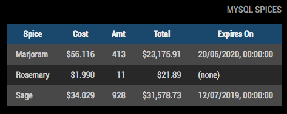
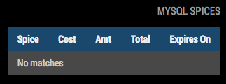

# MMM-MysqlQuery

A [MagicMirror²](https://magicmirror.builders) module to connect to a MySQL database, run a SELECT query and display the resultset as a styled HTML table.




Each table refreshes on a schedule you set in the `config.js` file.


## Installation

Run these commands at the root of your MagicMirror² install:

```shell
cd modules
git clone https://github.com/ralberth/MMM-MysqlQuery
cd MMM-MysqlQuery
npm install
cd ../..
```


## Upgrade

If you already have a version of MMM-MysqlQuery, run the following to pick up new code changes:

```shell
cd modules/MMM-MysqlQuery
git pull
npm install
```


## Configuration

Edit your `config/config.js` file and add a new object to the `modules` array like any other module:

```js
var config = {
    modules: [
        {
            module: 'MMM-MysqlQuery',
            config: {
                connection: {
                    host: "server-status-info.blah.us-east-1.amazon.com",
                    port: 3306,
                    user: "joeshmoe",
                    password: "coffeecoffeecoffee",
                    database: "nagios-export"
                },
                query: `select name, price, qty, price * qty as total, expires
                        from spices
                        order by name
                        limit 3`,
    			intervalSeconds: 15 * 60,
                emptyMessage: "No spices",
                columns: [
                    { name: "name",     title: "Spice", cssClass: "left", nullValue: "???" },
                    { name: "price",    title: "Cost", cssClass: "right", precision: 3, prefix: "$" },
                    { name: "qty",      title: "Amt",  cssClass: "right" },
                    { name: "total",    title: "Total", cssClass: "right", precision: 2,
                                        prefix: "$", thousandsSeparator: "," },
                    { name: "expires",  title: "Expires On", nullValue: "(none)",
                                        dateFormat: "datetime", dateLocale: "en-GB" }
                ]
            }
        }
    ]
}
```


| **Option** | **Type** | **Required?** | **Description** |
| --- | --- | --- | --- |
| `connection` | object | yes | Object with fields suitable for connecting to MySQL.  This entire object is passed to function `createConnection` in the Node.js "mysql" module.  The specific attributes recognized are documented at [www.npmjs.com/package/mysql](https://www.npmjs.com/package/mysql#connection-options).  The full docs of the library are at [www.npmjs.com/package/mysql](https://www.npmjs.com/package/mysql).  The items below in this table are a quick reference to the commonly-used keys so you don't have to jump to the other docs all the time. |
| `connection.host` | string | yes | Full DNS hostname or IP address of the MySQL database |
| `connection.port` | number | yes | Port MySQL is listening on (probably 3306) |
| `connection.user` | string | NO  | Optional username to use when connecting |
| `connection.password` | string | NO | Optional password for `connection.user` |
| `connection.database` | string | yes | Database name inside the MySQL instance |
| `query` | string | yes | SQL SELECT to run on the server (bind variables not supported, all values hard-coded inline).  You can use the back-tick syntax to write multi-line strings ("here" strings) in the `config/config.js` file for readability. |
| `intervalSeconds` | number | yes | Number of seconds to wait before re-running the `query` above and replacing the HTML table on the screen |
| `emptyMessage` | string | yes | Short, human-readable string to display on the screen if `query` completes successfully but returns no matching rows. |
| `columns` | array of objects | required | Array of objects, each of which defines a column to display in the HTML table, with formatting parameters.  The columns displayed on the screen are determined by the order and `title` given in this `columns` array, **not based on the order of columns returned from the database**.  This means if you don't keep `columns` in sync with the names of the columns in `query`, you may have empty columns in HTML table, or columns returned from the database that are ignored. |
| `columns[n].name` | string | yes | Name of the column returned from `query` to display in the HTML table |
| `columns[n].title` | string | NO | Title for this column on HTML table.  If this is omitted, `name` is used instead. |
| `columns[n].cssClass` | string | NO | CSS class name to add to the `<td>` element for each cell of this column.  This can be literally anything you want.  For custom styling, create your own CSS file and reference your class names here in `cssClass`.  By default, no class it added to the TD element.  MMM-MysqlQuery ships with three pre-defined class names you can use: `left`, `center`, and `right` that just set `text-align` appropriately. |
| `columns[n].nullValue` | string | NO | If a null value is returned from `query` for this column, `nullValue` will be used instead of an empty string. |
| `columns[n].precision` | number | NO | Sets the number of decimal places to display to this many digits, fixed. |
| `columns[n].thousandsSeparator` | string | NO | When displaying numbers, use this value as the separator between groups of three whole digits.  For example, use `" "` for French and German, `"."` for Italian and Norwegian, and `","` for US-English and Thai (see [this doc from Oracle](https://docs.oracle.com/cd/E19455-01/806-0169/overview-9/index.html) for examples). |
| `columns[n].prefix` | string | NO | Arbitrary string to display in each cell before the value returned from the database query. |
| `columns[n].suffix` | string | NO | Arbitrary string to display in each cell after the value returned from the database query. |
| `columns[n].dateFormat` | `date`, `time`, or `datetime` | NO | Controls if the date, time, or both is displayed for columns holding date/time data.
| `columns[n].dateLocale` | string | NO | How to format date and time data in your locale.  Value is an ISO 639-1 2 or 5 character abbreviation, like "fr" for generic English, "fr-FR" for French as spoken in France, or "fr-CA" for French as spoken in Canada. |
| `column[n].displayType`| `text` or `html` | NO | Controls how values from the database are inserted into the HTML DOM.  `text` means all HTML-specific stuff is escaped so if the database value is `<b>hi!</b>` this will appear literally.  `html` does no escaping, so   `<b>hi!</b>` will display as "**hi!**".  The default is `text`. |


### Quick Column Recipes

Don't sweat the above, odds are you can just include `{ name: "fubar" }` and let the system display something good enough.

| **Type of Data** | **Recipe** | **Comments**
|-----|-----|-----|
| Plain strings | `{ name: "fubar" }` | Take defaults for everything.  Column name in HTML is column name from database (`fubar` in this example) |
| Numbers | `{ name: "fubar" }` | Takes default display for the number, based on the server type.
| Currency in USA | `{ name: "fubar" precision: 2, thousandsSeparator: ",", prefix: "$" }` | Prefix with "$", 2 decimal places
| Currency in Germany | `{ name: "fubar" precision: 2, thousandsSeparator: " ", suffix: "€" }` | Non-English european languages put the Euro symbol after the digits, see [wikipedia](https://en.wikipedia.org/wiki/Euro_sign#Usage).
| Dates | `{ name: "fubar", dateFormat: "date", dateLocale: "es-ES" }` | Only displays day, month, and year in Spanish locale


## TO DO

Other ideas and things I'd like to build in eventually.  Feel free to comment and suggest others.

* Fade the last row to black
* Conversion dictionaries that style or pick values to display based on lookup from the raw value from MySQL
